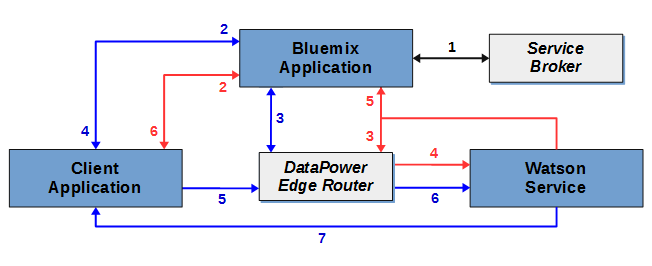

---

copyright:
  years: 2015, 2017
lastupdated: "2017-11-15"

---

{:shortdesc: .shortdesc}
{:new_window: target="_blank"}
{:tip: .tip}
{:pre: .pre}
{:codeblock: .codeblock}
{:screen: .screen}
{:javascript: .ph data-hd-programlang='javascript'}
{:java: .ph data-hd-programlang='java'}
{:python: .ph data-hd-programlang='python'}
{:swift: .ph data-hd-programlang='swift'}

# Programming models for {{site.data.keyword.watson}} services

{{site.data.keyword.watson}} services support two typical programming models for HTTP communications: Relaying requests via a proxy and Direct interaction with a service.

All {{site.data.keyword.watson}} services offer REST interfaces. Some services offer other programming interfaces, as well. For example, the Speech to Text service includes a WebSocket interface that you can use to establish a persistent connection with the service. To learn more about the available interfaces for service, see its documentation.
{: shortdesc}

## Choosing a model

Because of their reliance on either service credentials or tokens, each programming models offers different advantages and disadvantages.

Direct communication with tokens offers a powerful programming model. In some cases, it makes available additional functionality, such as the WebSocket interface of the Speech to Text service. But exercise caution when using tokens with your applications.

## Relaying requests via a proxy

This model requires that the client and the service communicate via a server-side proxy application that resides in {{site.data.keyword.Bluemix}}. The approach relies on HTTP basic authentication credentials for the service for secure communications.

In this model, the client and the service do not communicate directly. They instead relay all communications through the {{site.data.keyword.Bluemix_notm}} proxy application. The proxy application is responsible for receiving requests from the client, passing them to the service, getting a response from the service, and passing the results to the client. The proxy must include the authentication credentials in each request to the service.

For more information, see [Service credentials for {{site.data.keyword.watson}} services](/docs/services/watson/getting-started-credentials.html).

### Advantages of relaying requests

Data is made available in {{site.data.keyword.Bluemix_notm}}, where it can be stored and used with multiple services. With direct interaction, data is available only at the client.

The authentication model  is simpler than for direct interaction. Because the model requires authentication only from {{site.data.keyword.Bluemix_notm}}, it can safely use HTTP basic authentication credentials for a service.

### Disadvantages of relaying requests

The approach requires development of a server-side proxy application, and this proxy and the client  must establish a protocol to enable the exchange of requests and results. This proxy application is far more complex than the comparatively simple authentication proxy used with direct interaction.

Latency and performance are likely to suffer because of the need to establish additional connections and to relay information through the proxy server.

## Direct interaction with a service

With this model, a client communicates directly with a service without going through a proxy application in {{site.data.keyword.Bluemix_notm}}. The model relies on authentication tokens to enable secure communications. A server-side application still resides in {{site.data.keyword.Bluemix_notm}}, but this application acts only as an authentication proxy for the client.

The client sends an HTTP request to the proxy when it needs to obtain or refresh its token. The proxy in turn sends an HTTP `GET` request to the DataPower Edge Router to obtain the token. In addition to transparently routing all requests to {{site.data.keyword.watson}} services, the Edge Router includes a component that handles authentication for all services, including granting and validating tokens.

The proxy returns the token that it obtains from DataPower to the client. The client then uses the token for authenticated communications with the service. The client sends requests directly to the service, and the service responds to the client. The client must include the token in all requests that it sends to the service.

For more information, see [Tokens for authentication](/docs/services/watson/getting-started-tokens.html).

### Advantages of direct interaction

Eliminating the proxy server from the communication path leads to a simpler, more efficient implementation and higher throughput. Eliminating the proxy server reduces latency by eliminating the need to establish multiple connections to realize communications between the client and the service.

### Disadvantages of direct interaction

While using tokens does not expose your service credentials, it can expose the token to any potential cross-site scripting vulnerabilities in your application.

Tokens have a TTL of one hour. A client can make many calls to a service within the lifetime of the token. Because communications bypass the server-side proxy, the proxy cannot rate-limit or otherwise control the number of calls made by the client, which can result in excessive usage charges.

Tokens provide full access to the service instance. For services that maintain stateful data, tokens can enable malicious users to create, modify, or delete resources or even to delete the service instance itself.

## Communications paths

The following diagram presents a high-level overview of the two programming models:

- Common communication paths are shown in **black**.
- Communications specific to **relaying requests** via a proxy server are shown in <strong style="color:red">red</strong>.
- Communications for **direct interaction** are shown in <strong style="color:blue">blue</strong>.

<strong style="color:black; font-weight:bold">Common path (black path):</strong>

- 1: The server-side application binds to an instance of the service in {{site.data.keyword.Bluemix_notm}}.
    - For relaying requests via proxy, this application  handles all communications between the client and the service.
    - For relaying requests via proxy, this application  handles all communications between the client and the service.

    When bound to the service, the {{site.data.keyword.Bluemix_notm}} application can access its `VCAP_SERVICES` [environment variable](/docs/services/watson/getting-started-variables.html). This variable includes the connection URL for the service, the client's basic authentication credentials for the service, and other information associated with the application.

The communications paths now diverge.

<strong style="color:red; font-weight:bold">Relaying via a proxy model (red path):</strong>

- 2: The client application sends requests to the {{site.data.keyword.Bluemix_notm}} application over an API that is defined by the application developer.
- 3: The {{site.data.keyword.Bluemix_notm}} application passes the request from the client to the service by using the service's REST API. The request must include the HTTP basic authentication credentials for the service obtained from the `VCAP_SERVICES` [environment variable](/docs/services/watson/getting-started-variables.html).
- 4: All requests pass through the DataPower Edge Router. The Edge Router validates the authentication credentials and routes the request to the service.
- 5: The service sends the results of the request to the {{site.data.keyword.Bluemix_notm}} proxy application.
- 6: The {{site.data.keyword.Bluemix_notm}} application returns the results to the client over the application-defined API.

<strong style="color:blue; font-weight:bold">Direct interaction (blue path):</strong>

- 2: The client application requests an authentication token from the {{site.data.keyword.Bluemix_notm}} application, typically via an HTTP `GET` request.
- 3: The {{site.data.keyword.Bluemix_notm}} application sends an HTTP `GET` request to the  authentication component of the DataPower Edge Router. The request includes the HTTP basic authentication credentials for the service obtained from the `VCAP_SERVICES` environment variable.The Edge  Router responds with a time-limited authentication token that the  client can use to make requests to the service.
- 4: The {{site.data.keyword.Bluemix_notm}} application returns the authentication token to  the client. The client then communicates with the {{site.data.keyword.Bluemix_notm}} application only when it needs to refresh its token.
- 5: The client sends requests directly to the service via the service's  REST API. The client must pass its authentication token with each  request via the `X-Watson-Authorization-Token` request header, the `watson-token` query parameter, or as a cookie.
- 6: All requests pass through the DataPower Edge Router. The Edge Router  validates the client's token and routes the request to the service.
- 7: The service responds directly to the client.
