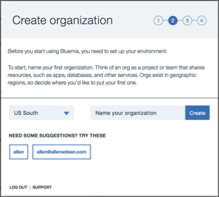
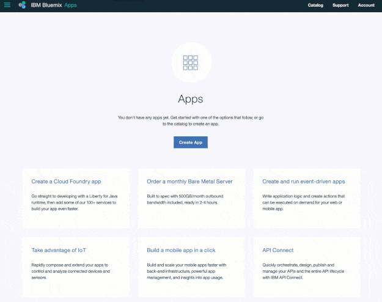
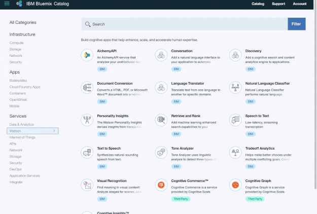
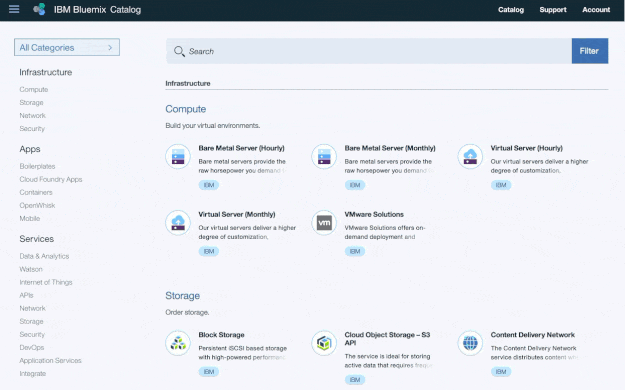

---

copyright:
  years: 2015, 2017
lastupdated: "2017-08-21"

---

{:shortdesc: .shortdesc}
{:new_window: target="_blank"}
{:tip: .tip}
{:pre: .pre}
{:codeblock: .codeblock}
{:screen: .screen}
{:javascript: .ph data-hd-programlang='javascript'}
{:java: .ph data-hd-programlang='java'}
{:python: .ph data-hd-programlang='python'}
{:swift: .ph data-hd-programlang='swift'}

# Getting started with Watson and Bluemix
{: #about}

You're just a few steps away from getting started with {{site.data.keyword.ibmwatson}}.
{: shortdesc}

## Step 1: Getting a free Bluemix account
{: #free-account}

Create a free 30-day trial account on {{site.data.keyword.Bluemix}}. [Sign-up for free ](https://console.{DomainName}/registration/?target=/catalog/%3fcategory=watson){: new_window}. You'll receive an email to activate your account.

{{site.data.keyword.Bluemix}} is the cloud platform that hosts {{site.data.keyword.watson}} services. [Learn more](/docs/overview/whatisbluemix.html).

## Step 2: Setting up your Bluemix account

After you activate your account and log in, you go through a simple process to set up your environment. A wizard takes you through the process:

## Step 3: Finding a service
Next, you pick a {{site.data.keyword.watson}} service to work with.

If you're not already there, select **Catalog** and then **{{site.data.keyword.watson}}** to get to the list of services.

## Step 4: Creating a service instance
{{site.data.keyword.Bluemix_notm}} provides resources to your applications through a *service instance*. Create your own instance.

Select a service from the {{site.data.keyword.watson}} catalog and start using it for free by clicking **Create**.

## Step 5: Getting service credentials
{: #get-service-credentials}

Click **Service credentials** and then **View credentials** in the Service credentials section to get your authentication information. You'll use the information that is displayed as the credentials to authenticate to your service instance from your app.

Here's how to find the credential information later from your {{site.data.keyword.Bluemix_notm}} dashboard.

## Next steps: Starting to code

You're ready to go. You have the account and service information that you need. Start [building with {{site.data.keyword.watson}} ](https://console.{DomainName}/watson/){: new_window}!
