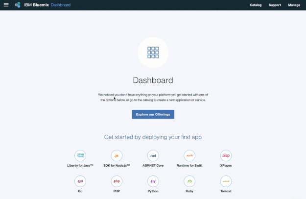
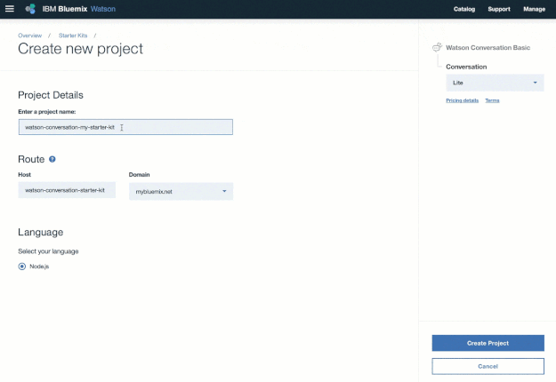

---

copyright:
  years: 2015, 2017
lastupdated: "2017-11-16"

---

{:shortdesc: .shortdesc}
{:new_window: target="_blank"}
{:tip: .tip}
{:pre: .pre}
{:codeblock: .codeblock}
{:screen: .screen}
{:javascript: .ph data-hd-programlang='javascript'}
{:java: .ph data-hd-programlang='java'}
{:python: .ph data-hd-programlang='python'}
{:swift: .ph data-hd-programlang='swift'}

# Getting started with Watson and {{site.data.keyword.Bluemix_notm}}
{: #about}

You're just a few steps away from getting started with {{site.data.keyword.ibmwatson}}.
{: shortdesc}

## Step 1: Getting a free {{site.data.keyword.Bluemix_notm}} account
{: #free-account}

Create an account on {{site.data.keyword.cloud_notm}} to try services for free with no time restrictions. [Sign-up for free ](https://console.{DomainName}/registration/?target=%2Fdeveloper%2Fwatson%2Fdashboard){: new_window}. You'll receive an email to confirm and activate your account.

## Step 2: Finding a starter kit or service
{: #access-console}

After you activate your account and log in, pick a {{site.data.keyword.watson}} starter kit that fits your needs, or select from one of the {{site.data.keyword.watson}} services.

If you're not already at the {{site.data.keyword.watson}} console, select **Watson** from the menu. ([Take me there ](https://console.{DomainName}/developer/watson/){: new_window})

## Step 3: Creating a project
{: #create-project}

A project provides resources to your applications. Create a project from your starter kit or services and start using it for free.

## Next steps: Starting to code

You're ready to go. Your project has the details that you need.

Use the link in the **Knowledge Guide** to get started, and start [building with {{site.data.keyword.watson}} ](https://console.{DomainName}/developer/watson/dashboard){: new_window}!
