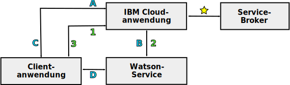

---

copyright:
  years: 2015, 2018
lastupdated: "2018-05-03"

---

{:shortdesc: .shortdesc}
{:new_window: target="_blank"}
{:tip: .tip}
{:pre: .pre}
{:codeblock: .codeblock}
{:screen: .screen}
{:javascript: .ph data-hd-programlang='javascript'}
{:java: .ph data-hd-programlang='java'}
{:python: .ph data-hd-programlang='python'}
{:swift: .ph data-hd-programlang='swift'}

# Programmiermodelle für {{site.data.keyword.watson}}-Services

Die {{site.data.keyword.watson}}-Services unterstützen zwei typische Programmiermodelle für die HTTP-Kommunikation: Weiterleiten von Anfragen über einen Proxy und direkte Interaktion mit einem Service.

Alle {{site.data.keyword.watson}}-Services bieten REST-Schnittstellen an. Einige Services bieten auch andere Programmierschnittstellen. Beispiel: Der {{site.data.keyword.speechtotextshort}}-Service enthält eine WebSocket-Schnittstelle, mit eine persistente Verbindung mit dem Service hergestellt wird. Weitere Informationen zu den verfügbaren Schnittstellen für diesen Service finden Sie in der entsprechenden Dokumentation.
{: shortdesc}

## Ein Modell auswählen

Aufgrund ihrer Abhängigkeit von Serviceberechtigungsnachweisen oder Tokens bietet jedes Programmiermodell verschiedene Vor- und Nachteile.

Die direkte Kommunikation mit Tokens bietet ein leistungsfähiges Programmiermodell. In einigen Fällen werden weitere Funktionen zur Verfügung gestellt, z. B. die WebSocket-Schnittstelle des {{site.data.keyword.speechtotextshort}}-Services. Gehen Sie vorsichtig vor, wenn Sie Token mit Ihren Anwendungen verwenden. 

## Anforderungen über einen Proxy weiterleiten

Bei diesem Modell ist es erforderlich, dass der Client und der Service über eine serverseitige Proxyanwendung kommunizieren, die sich in {{site.data.keyword.cloud}} befindet. Der Ansatz basiert auf Berechtigungsnachweisen für die HTTP-Basisauthentifizierung für den Service für eine sichere Kommunikation.

In diesem Modell kommunizieren der Client und der Service nicht direkt miteinander. Stattdessen leiten sie die Kommunikation über eine {{site.data.keyword.cloud_notm}}-Proxyanwendung. Die Proxyanwendung ist dafür zuständig, Anforderungen vom Client zu empfangen, sie an den Service zu übergeben, eine Antwort vom Service zu empfangen und die Ergebnisse an den Client weiterzuleiten. Der Proxy muss die Authentifizierungsnachweise bei jeder Anfrage an den Service enthalten.

Weitere Informationen finden Sie in [Serviceberechtigungsnachweise für {{site.data.keyword.watson}}-Services](/docs/services/watson/getting-started-credentials.html).

### Vorteile der Weiterleitung von Anforderungen

Daten werden in {{site.data.keyword.cloud_notm}} zur Verfügung gestellt, wo sie gespeichert und mit mehreren Services verwendet werden können. Bei direkter Interaktion sind Daten nur beim Client verfügbar.

Das Authentifizierungsmodell ist einfacher als die direkte Interaktion. Da das Modell nur eine Authentifizierung von {{site.data.keyword.cloud_notm}} erfordert, kann es Berechtigungsnachweise für die HTTP-Basisauthentifizierung für einen Service sicher verwenden.

### Nachteile der Weiterleitung von Anforderungen

Für diesen Ansatz ist die Entwicklung einer serverseitigen Proxyanwendung erforderlich. Der Proxy und der Client müssen ein Protokoll einrichten, um den Austausch von Anforderungen und Ergebnissen zu ermöglichen. Diese Proxyanwendung ist weitaus komplexer als der vergleichsweise einfache Authentifizierungsproxy, der bei der direkten Interaktion verwendet wird.

Latenz und Leistung leiden wahrscheinlich darunter, dass zusätzliche Verbindungen hergestellt und Informationen über den Proxy-Server weitergeleitet werden müssen.

## Direkte Interaktion mit einem Service

Bei diesem Modell kommuniziert ein Client direkt mit einem Service, ohne eine Proxyanwendung in {{site.data.keyword.cloud_notm}} durchlaufen zu müssen. Das Modell basiert auf Authentifizierungstoken, um eine sichere Kommunikation zu ermöglichen. Eine serverseitige Anwendung befindet sich weiterhin in {{site.data.keyword.cloud_notm}}. Diese Anwendung dient aber nur als Authentifizierungsproxy für den Client. 

Der Client sendet eine HTTP-Anforderung an den Proxy, wenn er sein Token abrufen oder aktualisieren muss. Der Proxy wiederum sendet die HTTP-Abrufanforderung `GET` und fordert das Token an. {{site.data.keyword.cloud_notm}} erhält zusätzlich zur transparenten Weiterleitung aller Anforderungen an die {{site.data.keyword.watson}}-Services eine Komponente, die die Authentifizierung für alle Services übernimmt, einschließlich der Gewährung und Validierung von Token.

Der Proxy gibt das Token an den Client zurück. Der Client verwendet dann das Token für die authentifizierte Kommunikation mit dem Service. Der Client sendet Anfragen direkt an den Service, und der Service antwortet dem Client. Der Client muss das Token in alle Anfragen aufnehmen, die an den Service gesendet werden.

Weitere Informationen finden Sie in [Token für die Authentifizierung](/docs/services/watson/getting-started-tokens.html).

### Vorteile der direkten Interaktion

Das Entfernen des Proxy-Servers aus dem Übertragungsweg führt zu einer einfacheren, effizienteren Implementierung und einem höheren Durchsatz. Durch die Entfernung des Proxy-Servers reduziert sich die Latenz, indem die Notwendigkeit entfällt, mehrere Verbindungen einzurichten, um die Kommunikation zwischen dem Client und dem Service umzusetzen. 

### Nachteile der direkten Interaktion

Durch die Verwendung von Token werden Ihre Serviceberechtigungsnachweise nicht verfügbar gemacht. Sie können das Token jedoch möglichen Cross-Site-Scripting-Schwachstellen in Ihrer Anwendung aussetzen. 

Token haben eine Lebensdauer von einer Stunde. Ein Client kann innerhalb der Token-Lebensdauer unzählige Aufrufe an einen Service tätigen. Da die Kommunikation den serverseitigen Proxy umgeht, kann der Proxy die Anzahl der vom Client getätigten Aufrufe nicht begrenzen oder anderweitig kontrollieren, was zu übermäßigen Nutzungsgebühren führen kann.

Token bieten einen uneingeschränkten Zugriff auf die Serviceinstanz. Für Services, die zustandsüberwachte Daten verwalten, können Token es böswilligen Benutzern ermöglichen, Ressourcen zu erstellen, zu bearbeiten oder zu löschen und sogar die Serviceinstanz selbst zu löschen.

## Kommunikationspfade

Das folgende Diagramm zeigt eine allgemeine Übersicht der beiden Programmiermodelle:

- Kommunikation, die über einen Proxy-Server **Anforderungen weiterleiten**, wird mit Zahlen versehen.
- Kommunikation für die **direkte Interaktion** wird mit Buchstaben versehen.

### Allgemeiner Pfad

- : Die serverseitige Anwendung bindet sich an eine Instanz des Services in {{site.data.keyword.cloud_notm}}. Diese Anwendung behandelt die gesamte Kommunikation zwischen Client und Service.

    Wenn sie an den Dienst gebunden ist, kann die {{site.data.keyword.cloud_notm}}-Anwendung auf die Umgebungsvariable `VCAP_SERVICES` [zugreifen](/docs/services/watson/getting-started-variables.html). Diese Variable enthält die Verbindungs-URL für den Service, die Berechtigungsnachweise der Clientbasisauthentifizierung für den Service und andere Informationen, die mit der Anwendung verknüpft sind.

Die Kommunikationspfade gehen jetzt auseinander.

### Über ein Proxy-Modell weiterleiten (mit Zahlen versehen)

- 1: Die Clientanwendung sendet Anforderungen über eine vom Anwendungsentwickler definierte API an die {{site.data.keyword.cloud_notm}}-Anwendung.
- 2: Die {{site.data.keyword.cloud_notm}}-Anwendung leitet die Anforderung vom Client an den Service weiter, indem sie die REST-API des Service verwendet. Die Anforderung muss die Berechtigungsnachweise für die HTTP-Basisauthentifizierung für den Service enthalten, der von der [Umgebungsvariablen](/docs/services/watson/getting-started-variables.html) `VCAP_SERVICES` abgerufen wird.
    - Der Service sendet die Ergebnisse der Anforderung an die {{site.data.keyword.cloud_notm}}-Proxyanwendung.
- 3: Die {{site.data.keyword.cloud_notm}}-Anwendung gibt die Ergebnisse über die anwendungsdefinierte API an den Client zurück.

### Direkte Interaktion (mit Buchstaben versehen)

- A: Die Clientanwendung fordert ein Authentifizierungstoken von der {{site.data.keyword.cloud_notm}}-Anwendung an, in der Regel über die HTTP-Abrufanforderung `GET`.
- B: Die {{site.data.keyword.cloud_notm}}-Anwendung sendet die HTTP-Abrufanforderung `GET` an die Authentifizierungskomponente für den Service. Die Anforderung enthält die Berechtigungsnachweise der HTTP-Basisauthentifizierung für den Service, der von der Umgebungsvariablen `VCAP_SERVICES` abgerufen wird. Der Service antwortet mit einem zeitlich begrenzten Authentifizierungstoken.
- C: Die {{site.data.keyword.cloud_notm}}-Anwendung gibt das Authentifizierungstoken zurück, das der Client für Anforderungen an den Service verwenden soll. Der Client kommuniziert dann nur mit der {{site.data.keyword.cloud_notm}}-Anwendung, wenn er sein Token aktualisieren muss.
- D: Der Client sendet Anforderungen direkt über die API des Services an den Service. Der Client muss sein Authentifizierungstoken bei jeder Anforderung über den Anforderungsheader `X-Watson-Authorization-Token`, den Abfrageparameter `watson-token` oder als Cookie übergeben. Der Service validiert das Token des Clients und leitet die Anforderung an den Service weiter. Der Service antwortet dem Client direkt.
