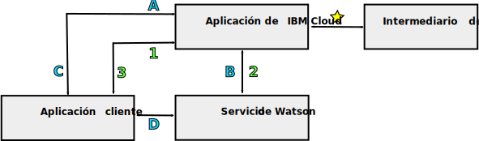

---

copyright:
  years: 2015, 2018
lastupdated: "2018-05-03"

---

{:shortdesc: .shortdesc}
{:new_window: target="_blank"}
{:tip: .tip}
{:pre: .pre}
{:codeblock: .codeblock}
{:screen: .screen}
{:javascript: .ph data-hd-programlang='javascript'}
{:java: .ph data-hd-programlang='java'}
{:python: .ph data-hd-programlang='python'}
{:swift: .ph data-hd-programlang='swift'}

# Programación de modelos para servicios de {{site.data.keyword.watson}}

Los servicios de {{site.data.keyword.watson}} dan soporte a dos modelos de programación típicos para las comunicaciones HTTP: Transmisión de solicitudes mediante un proxy e Interacción directa con un servicio.

Todos los servicios de {{site.data.keyword.watson}} ofrecen interfaces REST. Algunos servicios ofrecen otras interfaces de programación también. Por ejemplo, el servicio de {{site.data.keyword.speechtotextshort}} incluye una interfaz WebSocket que puede utilizar para establecer una conexión persistente con el servicio. Para obtener más información sobre las interfaces disponibles para el servicio, consulte su documentación.
{: shortdesc}

## Elección de un modelo

Debido a su dependencia de credenciales o señales de servicio, cada uno de los modelos de programación ofrece diferentes ventajas y desventajas.

Comunicación directa con señales ofrece un modelo de programación potente. En algunos casos, convierte en disponible la funcionalidad adicional, como la interfaz WebSocket del servicio de {{site.data.keyword.speechtotextshort}}. Pero tenga cuidado al utilizar señales con sus aplicaciones.

## Transmisión de solicitudes mediante un proxy

Este modelo necesita que el cliente y el servicio se comuniquen mediante una aplicación proxy de lado del servidor que reside en {{site.data.keyword.cloud}}. El enfoque se basa en las credenciales de autenticación básica HTTP para el servicio para comunicaciones seguras.

En este modelo, el cliente y el servicio no se comunican directamente. En su lugar, retransmiten todas las comunicaciones mediante la aplicación proxy de {{site.data.keyword.cloud_notm}}. La aplicación proxy es responsable de recibir solicitudes del cliente, de pasarlas al servicio, de obtener una respuesta del servicio y de pasar los resultados al cliente. El proxy debe incluir las credenciales de autenticación en cada solicitud en el servicio.

Para obtener más información, consulte [Credenciales de servicio para servicios de {{site.data.keyword.watson}}](/docs/services/watson/getting-started-credentials.html).

### Ventajas de transmitir las solicitudes

Los datos se hacen disponibles en {{site.data.keyword.cloud_notm}}, donde pueden almacenarse y utilizarse con varios servicios. Con la interacción directa, los datos están disponibles solo en el cliente.

El modelo de autenticación es más simple que para la interacción directa. Dado que el modelo solo requiere autenticación de {{site.data.keyword.cloud_notm}}, puede utilizar de forma segura las credenciales de autenticación básica HTTP para un servicio.

### Desventajas de transmitir las solicitudes

El enfoque requiere el desarrollo de una aplicación proxy de lado del servidor, y este proxy y el cliente deben establecer un protocolo para habilitar el intercambio de solicitudes y resultados. Esta proxy es mucho más compleja que el proxy de autenticación relativamente simple utilizado con la interacción directa.

La latencia y el rendimiento pueden sufrir debido a la necesidad de establecer conexiones adicionales y de transmitir información a través del servidor proxy.

## Interacción directa con un servicio

Con este modelo, un cliente se comunica directamente con un servicio sin pasar por una aplicación proxy en {{site.data.keyword.cloud_notm}}. El modelo se basa en las señales de autenticación para habilitar comunicaciones seguras. Una aplicación del lado del servidor seguirá residiendo en {{site.data.keyword.cloud_notm}}, pero esta aplicación solo actúa como un proxy de autenticación para el cliente.

El cliente envía una solicitud HTTP al proxy cuando necesita obtener o renovar su señal. El proxy, a su vez, envía una solicitud `GET` HTTP y obtiene la señal. Además de direccionar de forma transparente todas las solicitudes a los servicios de {{site.data.keyword.watson}}, {{site.data.keyword.cloud_notm}} incluye un componente que maneja la autenticación para todos los servicios, incluidas las señales de concesión y de validación.

El proxy devuelve la señal al cliente. El cliente utilizará entonces la señal para las comunicaciones autenticadas con el servicio. El cliente envía solicitudes directamente al servicio, y el servicio responde al cliente. El cliente debe incluir la señal en todas las solicitudes que envía al servicio.

Para obtener más información, consulte [Señales de autenticación](/docs/services/watson/getting-started-tokens.html).

### Ventajas de la interacción directa

La eliminación del servidor proxy de la vía de acceso de comunicación lleva a una implementación más simple y más eficiente y a un rendimiento más alto. La eliminación del servidor proxy reduce la latencia eliminando la necesidad de establecer varias conexiones para realizar las comunicaciones entre el cliente y el servicio.

### Desventajas de la interacción directa

Al utilizar señales, no exponga las credenciales de servicio, pues puede exponer la señal a cualquier vulnerabilidad de script entre sitios potencial en la aplicación.

Las señales tienen un TTL de una hora. Un cliente puede realizar muchas llamadas a un servicio dentro del tiempo de vida de la señal. Debido a que las comunicaciones ignoran el proxy de lado del servidor, el proxy no puede limitar la velocidad ni controlar de otra forma el número de llamadas realizadas por el cliente, lo que puede dar lugar a cargos de uso excesivos.

Las señales proporcionan acceso completo a la instancia de servicio. Para servicios que mantienen los datos con estado, las señales pueden habilitar usuarios maliciosos para crear, modificar o suprimir recursos o incluso para suprimir la propia instancia de servicio.

## Vías de acceso de comunicaciones

El diagrama siguiente presenta una visión general de alto nivel de los dos modelos de programación:

- Las comunicaciones específicas de **transmisión de solicitudes** mediante un servidor proxy se etiquetan con números.
- Las comunicaciones para la **interacción directa** se etiquetan con letras.

### Vía de acceso común

- : La aplicación de lado del servidor se enlaza a una instancia del servicio en {{site.data.keyword.cloud_notm}}. Esta aplicación maneja todas las comunicaciones entre el cliente y el servicio.

    Cuando está vinculada con el servicio, la aplicación {{site.data.keyword.cloud_notm}} puede acceder a su [variable de entorno](/docs/services/watson/getting-started-variables.html) `VCAP_SERVICES`. Esta variable incluye el URL de conexión para el servicio, las credenciales de autenticación básica del cliente para el servicio, y otra información asociada con la aplicación.

Las vías de acceso de comunicaciones ahora divergen.

### Transmisión mediante un modelo de proxy (etiquetada con números)

- 1: La aplicación cliente envía solicitudes a la aplicación {{site.data.keyword.cloud_notm}} mediante una API definida por el desarrollador de aplicaciones.
- 2: La aplicación {{site.data.keyword.cloud_notm}} pasa la solicitud del cliente al servicio utilizando la API REST de servicio. La solicitud debe incluir las credenciales de autenticación básica HTTP para el servicio obtenido desde la [variable de entorno](/docs/services/watson/getting-started-variables.html) `VCAP_SERVICES`.
    - El servicio envía los resultados de la solicitud a la aplicación proxy {{site.data.keyword.cloud_notm}}.
- 3: La aplicación {{site.data.keyword.cloud_notm}} devuelve los resultados al cliente mediante la API definida por la aplicación.

### Interacción directa (etiquetada con letras)

- A: La aplicación cliente solicita una señal de autenticación de la aplicación {{site.data.keyword.cloud_notm}}, normalmente mediante una solicitud `GET` HTTP.
- B: La aplicación {{site.data.keyword.cloud_notm}} envía una solicitud `GET` HTTP al componente de autenticación del servicio. La solicitud incluye las credenciales de autenticación básica HTTP para el servicio obtenido desde la variable de entorno `VCAP_SERVICES`. El servicio responde con una señal de autenticación limitada por tiempo.
- C: La aplicación {{site.data.keyword.cloud_notm}} devuelve la señal de autenticación para que la utilice el cliente en solicitudes al servicio. El cliente se comunicará entonces con la aplicación {{site.data.keyword.cloud_notm}} solo cuando necesite renovar su señal.
- D: El cliente envía solicitudes directamente al servicio mediante la API del servicio. El cliente debe pasar su señal de autenticación con cada solicitud mediante la cabecera de solicitud `X-Watson-Authorization-Token`, el parámetro de consulta `watson-token`, o como una cookie. El servicio valida la señal del cliente y direcciona la solicitud al servicio. El servicio responde directamente al cliente.
