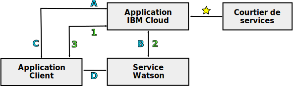

---

copyright:
  years: 2015, 2018
lastupdated: "2018-05-03"

---

{:shortdesc: .shortdesc}
{:new_window: target="_blank"}
{:tip: .tip}
{:pre: .pre}
{:codeblock: .codeblock}
{:screen: .screen}
{:javascript: .ph data-hd-programlang='javascript'}
{:java: .ph data-hd-programlang='java'}
{:python: .ph data-hd-programlang='python'}
{:swift: .ph data-hd-programlang='swift'}

# Programmation de modèles pour des services {{site.data.keyword.watson}}

Les services {{site.data.keyword.watson}} prennent en charge deux modèles de programmation courants pour les communications HTTP : les demandes de relais via un proxy et l'interaction directe avec un service.

Tous les services {{site.data.keyword.watson}} proposent des interfaces REST. Certains services proposent également d'autres interfaces de programmation. Par exemple, le service {{site.data.keyword.speechtotextshort}} inclut une interface WebSocket que vous pouvez utiliser pour établir une connexion permanente avec le service. Pour en savoir plus sur les interfaces disponibles pour le service, voir sa documentation.
{: shortdesc}

## Choix d'un modèle

Compte tenu de leur dépendance aux données d'identification ou aux jetons du service, chaque modèle de programmation présente différents avantages et inconvénients.

La communication directe avec des jetons offre un modèle de programmation puissant. Dans certains cas, elle met à disposition des fonctionnalités supplémentaires, telles que l'interface WebSocket du service {{site.data.keyword.speechtotextshort}}. Mais soyez prudent lorsque vous utilisez des jetons avec vos applications.

## Demandes de relais via un proxy

Ce modèle nécessite que le client et le service communiquent via une application proxy côté serveur qui réside dans {{site.data.keyword.cloud}}. Cette approche s'appuie sur les données d'authentification de base HTTP du service pour activer des communications sécurisées.

Avec ce modèle, le client et le service ne communiquent pas directement. Toutes leurs communications transitent via l'application proxy {{site.data.keyword.cloud_notm}}. L'application proxy se charge de recevoir les demandes du client, de les transmettre au service, d'obtenir une réponse du service et de transmettre les résultats au client. Le proxy doit inclure les données d'authentification dans chaque demande effectuée au service.

Pour plus d'informations, voir [Données d'identification de service pour les services {{site.data.keyword.watson}}](/docs/services/watson/getting-started-credentials.html).

### Avantages des demandes de relais

Les données sont mises à disposition dans {{site.data.keyword.cloud_notm}} où elles peuvent être stockées et utilisées par plusieurs services. Avec l'interaction directe, les données ne sont disponibles que sur le client.

Le modèle d'authentification est plus simple que pour l'interaction directe. Etant donné que ce modèle ne nécessite une authentification que depuis {{site.data.keyword.cloud_notm}}, il peut en toute sécurité utiliser les données d'authentification de base HTTP pour un service.

### Inconvénient des demandes de relais

Cette approche nécessite de développer une application proxy côté serveur et ce proxy et le client doivent établir un protocole pour activer l'échange des demandes et des résultats. Cette application proxy est bien plus complexe que le simple proxy d'authentification utilisé avec l'interaction directe.

Les temps d'attente et les performances sont également impactés du fait de la nécessité d'établir des connexions supplémentaires et de relayer les informations via le serveur proxy.

## Interaction directe avec un service

Avec ce modèle, un client communique directement avec un service sans passer par une application proxy dans {{site.data.keyword.cloud_notm}}. Le modèle s'appuie sur des jetons d'authentification pour activer des communications sécurisées. Une application côté serveur réside toujours dans {{site.data.keyword.cloud_notm}}, mais cette application fonctionne uniquement comme proxy d'authentification pour le client.

Le client envoie une demande HTTP au proxy lorsqu'il a besoin d'obtenir ou d'actualiser son jeton. Le proxy envoie en retour une demande HTTP `GET` et obtient le jeton. En plus d'acheminer en toute transparence toutes les demandes vers les services {{site.data.keyword.watson}}, {{site.data.keyword.cloud_notm}} inclut un composant qui gère l'authentification pour tous les services, y compris l'accord et la validation des jetons.

Le proxy renvoie le jeton au client. Le client utilise ensuite le jeton pour les communications authentifiées avec le service. Le client envoie ses demandes directement au service et le service répond au client. Le client doit inclure le jeton dans toutes les demandes qu'il envoie au service.

Pour plus d'informations, voir [Jetons d'authentification](/docs/services/watson/getting-started-tokens.html).

### Avantages de l'interaction directe

Du fait de la suppression du serveur proxy du chemin de communication, l'implémentation est plus simple et efficace et la capacité de traitement plus élevée. La suppression du serveur proxy réduit les temps d'attente puisqu'il n'est plus nécessaire d'initier plusieurs connexions pour établir les communications entre le client et le service.

### Inconvénients de l'interaction directe

Même si l'utilisation de jetons n'expose pas vos données d'identification du service, elle risque d'exposer le jeton à des vulnérabilités Cross-Site Scripting (XSS) dans votre application.

Un jeton dispose d'une durée de vie d'une heure. Un client peut effectuer de nombreux appels à un service pendant la durée de vie du jeton. Etant donné que les communications ignorent le proxy côté serveur, le proxy ne peut pas limiter le débit ni contrôler le nombre d'appels effectués par le client, ce qui peut entraîner des charges d'utilisation excessives.

Les jetons fournissent un accès complet à l'instance de service. Pour les services qui gèrent des données avec état, les jetons peuvent permettre à des utilisateurs malveillants de créer, modifier ou supprimer des ressources, voire même de supprimer l'instance de service.

## Chemins de communication

Le diagramme suivant est une présentation générale des deux modèles de programmation :

- Les communications propres aux **demandes de relais** via un serveur proxy sont libellées avec des numéros.
- Les communications d'**interaction directe** sont libellées avec des lettres.

### Chemin commun

-  : l'application côté serveur est liée à une instance du service dans {{site.data.keyword.cloud_notm}}. Cette application gère toutes les communications entre le client et le service.

    Une fois liée au service, l'application {{site.data.keyword.cloud_notm}} peut accéder à sa [variable d'environnement](/docs/services/watson/getting-started-variables.html), `VCAP_SERVICES`. Cette variable inclut l'URL de connexion du service, les données d'authentification de base du client pour le service ainsi que d'autres informations associées à l'application.

Les chemins de communication divergent maintenant.

### Relais via un modèle avec proxy (libellé avec des numéros)

- 1 : l'application client envoie une demande à l'application {{site.data.keyword.cloud_notm}} via une API définie par le développeur d'applications.
- 2 : l'application {{site.data.keyword.cloud_notm}} transmet la demande du client au service à l'aide de l'API REST du service. Le demande doit inclure les données d'authentification de base HTTP du service obtenue dans la [variable d'environnement](/docs/services/watson/getting-started-variables.html) `VCAP_SERVICES`.
    - Le service envoie les résultats de la demande à l'application proxy {{site.data.keyword.cloud_notm}}.
- 3 : l'application {{site.data.keyword.cloud_notm}} renvoie les résultats au client via l'API définie par l'application.

### Interaction directe (libellée avec des lettres)

- A : l'application client demande un jeton d'authentification à l'application {{site.data.keyword.cloud_notm}}, en général via une demande HTTP `GET`.
- B : l'application {{site.data.keyword.cloud_notm}} envoie une demande HTTP `GET` au composant d'authentification du service. Le demande inclut les données d'authentification de base HTTP du service obtenue dans la variable d'environnement `VCAP_SERVICES`. Le service répond avec un jeton d'authentification limité dans le temps.
- C : l'application {{site.data.keyword.cloud_notm}} envoie le jeton d'authentification au client qui doit l'utiliser dans ses demandes au service. Le client ne communique ensuite avec l'application {{site.data.keyword.cloud_notm}} que s'il a besoin d'actualiser son jeton.
- D : le client envoie ses demandes directement au service via l'API du service. Le client doit fournir son jeton d'authentification avec chaque demande via l'en-tête de requête `X-Watson-Authorization-Token`, le paramètre de requête `watson-token` ou en tant que cookie. Le service valide le jeton du client et achemine la demande vers le service. Le service répond directement au client.
