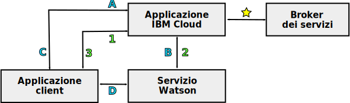

---

copyright:
  years: 2015, 2018
lastupdated: "2018-05-03"

---

{:shortdesc: .shortdesc}
{:new_window: target="_blank"}
{:tip: .tip}
{:pre: .pre}
{:codeblock: .codeblock}
{:screen: .screen}
{:javascript: .ph data-hd-programlang='javascript'}
{:java: .ph data-hd-programlang='java'}
{:python: .ph data-hd-programlang='python'}
{:swift: .ph data-hd-programlang='swift'}

# Modelli di programmazione per i servizi {{site.data.keyword.watson}}

I servizi {{site.data.keyword.watson}} supportano due tipici modelli di programmazione per le comunicazioni HTTP: l'inoltro di richieste tramite un proxy e l'interazione diretta con un servizio.

Tutti i servizi {{site.data.keyword.watson}} offrono delle interfacce REST. Alcuni servizi offrono anche altre interfacce di programmazione. Ad esempio, il servizio {{site.data.keyword.speechtotextshort}} include un'interfaccia WebSocket che puoi utilizzare per stabilire una connessione persistente con il servizio. Per ulteriori informazioni sulle interfacce disponibili per il servizio, consulta la relativa documentazione.
{: shortdesc}

## Scelta di un modello

A causa della dipendenza che ha dalle credenziali del servizio o dai token, ogni modello di programmazione offre vantaggi e svantaggi differenti.

La comunicazione diretta con i token offre un potente modello di programmazione. In alcuni casi, rende disponibile della funzionalità aggiuntiva, come l'interfaccia WebSocket del servizio {{site.data.keyword.speechtotextshort}}. Esercita comunque la massima cautela quando usi i token con le tue applicazioni.

## Inoltro delle richieste tramite un proxy

Questo modello richiede che il client e il servizio comunichino tramite un'applicazione proxy lato server che si trova in {{site.data.keyword.cloud}}. L'approccio si basa sulle credenziali di autenticazione di base HTTP per il servizio per le comunicazioni sicure.

In questo modello, il client e il servizio non comunicano direttamente. Inoltrano invece tutte le comunicazioni tramite l'applicazione proxy {{site.data.keyword.cloud_notm}}. L'applicazione proxy è responsabile delle ricezione delle richieste dal client, del loro passaggio al servizio, ottenendo da esso una risposta, e del passaggio dei risultati al client. Il proxy deve includere le credenziali di autenticazione in ogni richiesta al servizio.

Per ulteriori informazioni, consulta [Credenziali del servizio per i servizi {{site.data.keyword.watson}}](/docs/services/watson/getting-started-credentials.html).

### Vantaggi dell'inoltro delle richieste

I dati vengono resi disponibili in {{site.data.keyword.cloud_notm}}, dove possono essere memorizzati e utilizzati con più servizi. Con l'interazione diretta, i dati sono disponibili solo sul client.

Il modello di autenticazione è più semplice di quello per l'interazione diretta. Perché il modello richiede l'autenticazione solo da {{site.data.keyword.cloud_notm}}, può tranquillamente utilizzare le credenziali di autenticazione di base HTTP per un servizio.

### Svantaggi dell'inoltro delle richieste

L'approccio richiede lo sviluppo di un'applicazione proxy lato server e questo proxy e il client devono stabilire un protocollo per abilitare lo scambio di richieste e risultati. Questa applicazione proxy è molto più complessa del relativamente semplice proxy di autenticazione utilizzato con l'interazione diretta.

La latenza e le prestazioni probabilmente ne risentiranno a causa della necessità di stabilire delle connessioni aggiuntive e di inoltrare le informazioni tramite il server proxy.

## Interazione diretta con un servizio

Con questo modello, un client comunica direttamente con un servizio senza passare attraverso un'applicazione proxy in {{site.data.keyword.cloud_notm}}. Il modello si basa sui token di autenticazione per abilitare le comunicazioni sicure. Un'applicazione lato server continua a essere presente in {{site.data.keyword.cloud_notm}} ma essa funge solo da proxy di autenticazione per il client.

Il client invia una richiesta HTTP al proxy quando deve ottenere o aggiornare il suo token. Il proxy a sua volta invia una richiesta HTTP `GET` e ottiene il token. Oltre a instradare in modo trasparente tutte le richieste ai servizi {{site.data.keyword.watson}}, {{site.data.keyword.cloud_notm}} include un componente che gestisce l'autenticazione per tutti i servizi, comprese la concessione e la convalida dei token.

Il proxy restituisce il token al client. Il client utilizza quindi il token per le comunicazioni autenticate con il servizio. Il client invia le richieste direttamente al servizio e il servizio risponde al client. Il client deve includere il token in tutte le richieste che invia al servizio.

Per ulteriori informazioni, consulta [Token per l'autenticazione](/docs/services/watson/getting-started-tokens.html).

### Vantaggi dell'interazione diretta

Eliminare il server proxy dal percorso di comunicazione porta a un'implementazione più semplice e più efficiente e a una velocità effettiva più elevata. L'eliminazione del server proxy riduce la latenza poiché elimina la necessità di stabilire più connessioni per realizzare le comunicazioni tra il client e il servizio.

### Svantaggi dell'interazione diretta

Se da una parte i token non espongono le tue credenziali del servizio, dall'altra possono esporre il token a qualsiasi potenziale vulnerabilità XSS (Cross-Site Scripting) nella tua applicazione.

I token hanno un TTL di un'ora. Un client può eseguire molte chiamate a un servizio entro la durata del token. Poiché le comunicazioni ignorano il proxy lato server, il proxy non può limitare la frequenza o controllare in altro modo il numero di chiamate eseguite dal client, cosa che può dare luogo ad eccessivi addebiti di utilizzo.

I token forniscono un accesso completo all'istanza del servizio. Per i servizi che conservano dati con stato, i token possono consentire a utenti malintenzionati di creare, modificare o eliminare risorse o anche di eliminare l'istanza del servizio stessa.

## Percorsi delle comunicazioni

Il seguente diagramma presenta una panoramica di alto livello dei due modelli di programmazione:

- Le comunicazioni specifiche per l'**inoltro di richieste** tramite un server proxy sono etichettate con dei numeri.
- Le comunicazioni per l'**interazione diretta** sono etichettate con le lettere.

### Percorso comune

- : L'applicazione lato server esegue l'associazione a un'istanza del servizio in {{site.data.keyword.cloud_notm}}. Questa applicazione gestisce tutte le comunicazioni tra il client e il servizio.

    Quando è associata al servizio, l'applicazione {{site.data.keyword.cloud_notm}} può accedere alla sua [variabile di ambiente](/docs/services/watson/getting-started-variables.html) `VCAP_SERVICES`. Questa variabile comprende l'URL di connessione per il servizio, le credenziali di autenticazione di base del client per il servizio e altre informazioni associate all'applicazione.

I percorsi delle comunicazioni ora divergono.

### Inoltro tramite un modello proxy (etichettato con numeri)

- 1: L'applicazione client invia le richieste all'applicazione {{site.data.keyword.cloud_notm}} su un'API definita dallo sviluppatore dell'applicazione.
- 2: L'applicazione {{site.data.keyword.cloud_notm}} passa la richiesta dal client al servizio utilizzando l'API REST del servizio. La richieda deve includere le credenziali di autenticazione di base HTTP per il servizio ottenute dalla [variabile di ambiente](/docs/services/watson/getting-started-variables.html) `VCAP_SERVICES`.
    - Il servizio invia i risultati della richiesta all'applicazione proxy {{site.data.keyword.cloud_notm}}.
- 3: L'applicazione {{site.data.keyword.cloud_notm}} restituisce i risultati al client sull'API definita dall'applicazione.

### Interazione diretta (etichettata con delle lettere)

- A: L'applicazione client richiede un token di autenticazione dall'applicazione {{site.data.keyword.cloud_notm}}, di norma tramite una richiesta HTTP `GET`.
- B: L'applicazione {{site.data.keyword.cloud_notm}} invia una richiesta HTTP `GET` al componente di autenticazione del servizio. La richiesta include le credenziali di autenticazione di base HTTP per il servizio ottenute dalla variabile di ambiente `VCAP_SERVICES`. Il servizio risponde con un token di autenticazione di durata limitata.
- C: L'applicazione {{site.data.keyword.cloud_notm}} restituisce il token di autenticazione per il client da utilizzare nelle richieste al servizio. Il client comunica quindi con l'applicazione {{site.data.keyword.cloud_notm}} solo quando deve aggiornare il suo token.
- D: Il client invia le richieste direttamente al servizio tramite l'API del servizio. Il client deve passare il suo token di autenticazione con ogni richiesta tramite l'intestazione della richiesta `X-Watson-Authorization-Token`, il parametro di query `watson-token` o come un cookie. Il servizio convalida il token del client e instrada la richiesta al servizio. Il servizio risponde direttamente al client.
