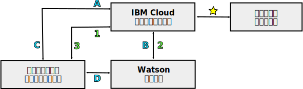

---

copyright:
  years: 2015, 2018
lastupdated: "2018-05-03"

---

{:shortdesc: .shortdesc}
{:new_window: target="_blank"}
{:tip: .tip}
{:pre: .pre}
{:codeblock: .codeblock}
{:screen: .screen}
{:javascript: .ph data-hd-programlang='javascript'}
{:java: .ph data-hd-programlang='java'}
{:python: .ph data-hd-programlang='python'}
{:swift: .ph data-hd-programlang='swift'}

# {{site.data.keyword.watson}} サービスのプログラミング・モデル

{{site.data.keyword.watson}} サービスでは、HTTP 通信用の 2 つの標準的なプログラミング・モデル (プロキシー経由の要求中継と、サービスとの直接対話) がサポートされています。

どの {{site.data.keyword.watson}} サービスにも REST インターフェースがあります。一部のサービスには、他のプログラミング・インターフェースも用意されています。例えば、{{site.data.keyword.speechtotextshort}} サービスには、サービスとの持続接続を確立するために使用できる WebSocket インターフェースが含まれています。サービスで使用できるインターフェースの詳細については、そのサービスの資料を参照してください。
{: shortdesc}

## モデルの選択

これらのプログラミング・モデルはサービスの資格情報かトークンのどちらかに頼るので、それぞれに利点と欠点があります。

トークンによる直接通信は、強力なプログラミング・モデルです。場合によっては、{{site.data.keyword.speechtotextshort}} サービスの WebSocket インターフェースなどの追加機能も使用できます。ただし、アプリケーションでトークンを使用する場合は注意が必要です。

## プロキシー経由の要求中継

このモデルでは、クライアントとサービスが、{{site.data.keyword.cloud}} にあるサーバー・サイドのプロキシー・アプリケーションを経由して通信する必要があります。この手法では、セキュア通信のために、サービスの HTTP 基本認証資格情報に頼ります。

このモデルでは、クライアントとサービスは直接通信しません。{{site.data.keyword.cloud_notm}} のプロキシー・アプリケーションですべての通信を中継します。プロキシー・アプリケーションが、クライアントから要求を受け取り、サービスに要求を渡し、サービスから応答を取得し、クライアントに結果を渡すことを担当します。プロキシーは、サービスへの各要求に認証資格情報を含める必要があります。

詳細については、[{{site.data.keyword.watson}} サービスのサービス資格情報](/docs/services/watson/getting-started-credentials.html)を参照してください。

### 要求中継の利点

データが {{site.data.keyword.cloud_notm}} で使用可能になります。ここでデータが保管され、複数のサービスで利用できます。直接対話の場合は、データをクライアントでしか使用できません。

認証モデルが直接対話の場合よりもシンプルです。このモデルでは、{{site.data.keyword.cloud_notm}} からの認証だけが必要なので、サービスで HTTP 基本認証資格情報を安全に使用できます。

### 要求中継の欠点

この手法では、サーバー・サイドのプロキシー・アプリケーションを開発しなければならず、プロキシーとクライアントとの間で要求と結果を交換するためのプロトコルを確立する必要があります。このプロキシー・アプリケーションは、直接対話で使用する比較的シンプルな認証プロキシーよりもはるかに複雑です。

追加の接続を確立してプロキシー・サーバー経由で情報を中継する必要があるので、待ち時間が長くなったりパフォーマンスが低下したりする可能性があります。

## サービスとの直接対話

このモデルの場合、クライアントは、{{site.data.keyword.cloud_notm}} のプロキシー・アプリケーションを経由しないでサービスと直接通信します。このモデルでは、セキュア通信を有効にするために、認証トークンに頼ります。この場合もサーバー・サイドのアプリケーションが {{site.data.keyword.cloud_notm}} に配置されますが、このアプリケーションはクライアントの認証プロキシーとしてのみ機能します。

クライアントは、トークンを取得したりリフレッシュしたりする必要がある時は、HTTP 要求をプロキシーに送信します。そうすると、プロキシーが HTTP `GET` 要求を送信してトークンを取得します。{{site.data.keyword.watson}} には、すべての要求を {{site.data.keyword.cloud_notm}} サービスに透過的にルーティングするだけでなく、すべてのサービスの認証 (トークンの付与や確認など) を処理するコンポーネントも含まれています。

プロキシーは、トークンをクライアントに返します。クライアントは、このトークンを使用して、サービスとの間で認証された通信を行います。クライアントは要求をサービスに直接送信し、サービスはクライアントに応答します。クライアントは、サービスに送信するすべての要求にトークンを含める必要があります。

詳細については、[認証用のトークン](/docs/services/watson/getting-started-tokens.html)を参照してください。

### 直接対話の利点

通信パスからプロキシー・サーバーが除かれるので、よりシンプルで効率的な実装が可能になり、スループットが向上します。プロキシー・サーバーがないため、クライアントとサービスの間の通信を実現するために複数の接続を確立する必要がなく、その分、待ち時間が短くなります。

### 直接対話の欠点

トークンの使用によってサービス資格情報が公開されることはありませんが、アプリケーションのクロスサイト・スクリプティングの脆弱性の危険にトークンがさらされるおそれはあります。

トークンの TTL は 1 時間です。クライアントは、トークンの存続期間中にサービスに対して多くの呼び出しを実行することがあります。通信ではサーバー・サイドのプロキシーがバイパスされるため、プロキシーでクライアントによる呼び出しのレート制限を掛けたり数を制御したりすることができず、高額の使用料金が発生するおそれがあります。

トークンによって、サービス・インスタンスへの全アクセス権限が提供されます。ステートフル・データを維持するサービスの場合は、トークンにより、悪意のあるユーザーがリソースを作成/変更/削除したり、サービス・インスタンスそのものを削除したりできるようになることがあります。

## 通信パス

2 つのプログラミング・モデルの概要を以下の図にまとめています。

- プロキシー・サーバー経由の**要求中継**に固有の通信には、番号のラベルを付けています。
- **直接対話**の通信には、文字のラベルを付けています。

### 共通パス

- : サーバー・サイド・アプリケーションは {{site.data.keyword.cloud_notm}} のサービス・インスタンスにバインドされます。このアプリケーションがクライアントとサービスの間のすべての通信を処理します。

    {{site.data.keyword.cloud_notm}} アプリケーションは、サービスにバインドすると、`VCAP_SERVICES` [環境変数](/docs/services/watson/getting-started-variables.html)にアクセスできるようになります。この変数に、サービスの接続 URL、サービスに対するクライアントの基本認証資格情報、アプリケーションに関連するその他の情報が含まれています。

通信パスはここから分岐します。

### プロキシー経由の中継のモデル (数字のラベル)

- 1: クライアント・アプリケーションが、アプリケーション開発者によって定義された API を使用して {{site.data.keyword.cloud_notm}} アプリケーションに要求を送信します。
- 2: {{site.data.keyword.cloud_notm}} アプリケーションがサービスの REST API を使用して、クライアントからの要求をサービスに渡します。この要求には、`VCAP_SERVICES` [環境変数](/docs/services/watson/getting-started-variables.html)から取得されたサービスの HTTP 基本認証資格情報が含まれている必要があります。
    - サービスが要求の結果を {{site.data.keyword.cloud_notm}} プロキシー・アプリケーションに送信します。
- 3: {{site.data.keyword.cloud_notm}} アプリケーションがアプリケーション定義の API を使用してクライアントに結果を返します。

### 直接対話 (文字のラベル)

- A: クライアント・アプリケーションが、通常、HTTP `GET` 要求を使用して、{{site.data.keyword.cloud_notm}} アプリケーションに認証トークンを要求します。
- B: {{site.data.keyword.cloud_notm}} アプリケーションがサービスの認証コンポーネントに HTTP `GET` 要求を送信します。この要求には、`VCAP_SERVICES` 環境変数から取得されたサービスの HTTP 基本認証資格情報が含まれます。サービスが時間制限付きの認証トークンで応答します。
- C: {{site.data.keyword.cloud_notm}} アプリケーションが認証トークンを返します。クライアントは、サービスへの要求でそのトークンを使用します。クライアントが {{site.data.keyword.cloud_notm}} アプリケーションと通信するのは、トークンをリフレッシュする必要がある場合に限られます。
- D: クライアントがサービスの API を使用して要求をサービスに直接送信します。クライアントは、各要求で、`X-Watson-Authorization-Token` 要求ヘッダー、`watson-token` 照会パラメーター、Cookie のいずれかを使用して、認証トークンを渡す必要があります。サービスがクライアントのトークンを検証し、要求をサービスに送付します。サービスはクライアントに直接応答します。
