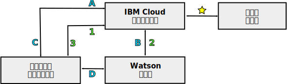

---

copyright:
  years: 2015, 2018
lastupdated: "2018-05-03"

---

{:shortdesc: .shortdesc}
{:new_window: target="_blank"}
{:tip: .tip}
{:pre: .pre}
{:codeblock: .codeblock}
{:screen: .screen}
{:javascript: .ph data-hd-programlang='javascript'}
{:java: .ph data-hd-programlang='java'}
{:python: .ph data-hd-programlang='python'}
{:swift: .ph data-hd-programlang='swift'}

# {{site.data.keyword.watson}} 서비스에 대한 프로그래밍 모델

{{site.data.keyword.watson}} 서비스는 HTTP 통신에 대한 두 가지 일반 프로그래밍 모델(프록시를 통한 요청 릴레이 및 서비스와 직접 상호작용)을 지원합니다. 

모든 {{site.data.keyword.watson}} 서비스는 REST 인터페이스를 제공합니다. 일부 서비스는 다른 프로그래밍 인터페이스도 제공합니다. 예를 들어, {{site.data.keyword.speechtotextshort}} 서비스에는 서비스와의 지속적 연결을 설정하는 데 사용할 수 있는 WebSocket 인터페이스가 포함됩니다. 서비스에 사용 가능한 인터페이스에 대해 자세히 알아보려면 해당 문서를 참조하십시오.
{: shortdesc}

## 모델 선택

각 프로그래밍 모델은 서비스 신임 정보 또는 토큰에 의존하므로 여러 가지 장점과 단점을 제공합니다.

토큰과의 직접 통신은 강력한 프로그래밍 모델을 제공합니다. 일부 경우에 {{site.data.keyword.speechtotextshort}} 서비스의 WebSocket 인터페이스와 같은 추가 기능을 사용할 수 있습니다. 그러나 애플리케이션에서 토큰을 사용할 때는 주의하십시오.

## 프록시를 통한 요청 릴레이

이 모델에서는 클라이언트 및 서비스가 {{site.data.keyword.cloud}}에 있는 서버 측 프록시 애플리케이션을 통해 통신해야 합니다. 이 접근 방식은 보안 통신을 위해 서비스에 대한 HTTP 기본 인증 신임 정보에 의존합니다.

이 모델에서는 클라이언트와 서비스가 직접 통신하지 않습니다. 대신 {{site.data.keyword.cloud_notm}} 프록시 애플리케이션을 통해 모든 통신을 릴레이합니다. 프록시 애플리케이션은 클라이언트로부터 요청을 수신하여 서비스에 전달하고 서비스에서 응답을 가져오며 결과를 클라이언트에 전달하는 역할을 담당합니다. 프록시는 서비스에 대한 각 요청에 인증 신임 정보를 포함해야 합니다.

자세한 정보는 [{{site.data.keyword.watson}} 서비스에 대한 서비스 신임 정보](/docs/services/watson/getting-started-credentials.html)를 참조하십시오.

### 요청 릴레이의 장점

{{site.data.keyword.cloud_notm}}에서 데이터를 사용할 수 있습니다. 여기서 데이터를 저장하고 여러 서비스에 사용할 수 있습니다. 직접 상호작용으로 사용하면 데이터가 클라이언트에서만 사용 가능합니다.

인증 모델은 직접 상호작용의 경우보다 더 단순합니다. 이 모델에는 {{site.data.keyword.cloud_notm}}의 인증만 필요하기 때문에 서비스에 대한 HTTP 기본 인증 신임 정보를 안전하게 사용할 수 있습니다.

### 요청 릴레이의 단점

이 접근 방식에는 서버 측 프록시 애플리케이션의 개발이 필요하며 이 프록시와 클라이언트가 요청 및 결과의 교환을 가능하게 하는 프로토콜을 설정해야 합니다. 이 프록시 애플리케이션은 직접 상호작용에 사용되는 비교적 단순한 인증 프록시에 비해 훨씬 더 복잡합니다.

추가 연결을 설정하고 프록시 서버를 통해 정보를 릴레이해야 하므로 대기 시간 및 성능이 저하될 수 있습니다.

## 서비스와의 직접 상호작용

이 모델을 사용하면 클라이언트가 {{site.data.keyword.cloud_notm}}의 프록시 애플리케이션을 통과하지 않고 서비스와 직접 통신합니다. 이 모델은 인증 토큰에 의존하여 보안 통신을 사용합니다. 서버 측 애플리케이션은 여전히 {{site.data.keyword.cloud_notm}}에 있지만 이 애플리케이션은 클라이언트에 대한 인증 프록시 역할만 수행합니다.

클라이언트가 해당 토큰을 얻거나 새로 고쳐야 할 때 HTTP 요청을 프록시에 전송합니다. 그 다음 프록시가 HTTP `GET` 요청을 전송하고 토큰을 얻습니다. 모든 요청을 {{site.data.keyword.watson}} 서비스에 투명하게 라우팅하는 것 이외에 {{site.data.keyword.cloud_notm}}에는 토큰 권한 부여 및 유효성 검증을 포함하여 모든 서비스에 대한 인증을 처리하는 컴포넌트가 포함됩니다.

프록시가 토큰을 클라이언트에 리턴합니다. 그런 다음 클라이언트가 서비스와의 인증된 통신을 위해 토큰을 사용합니다. 클라이언트가 서비스에 직접 요청을 전송하고 서비스가 클라이언트에 응답합니다. 클라이언트가 서비스에 전송하는 모든 요청에 토큰을 포함해야 합니다.

자세한 정보는 [인증을 위한 토큰](/docs/services/watson/getting-started-tokens.html)을 참조하십시오.

### 직접 상호작용의 장점

통신 경로에서 프록시 서버를 제거하면 보다 단순하고 효율적으로 구현되며 처리량이 높아집니다. 프록시 서버를 제거하면 클라이언트와 서비스 간의 통신을 실현하기 위해 여러 연결을 설정해야 할 필요가 없어지므로 대기 시간이 단축됩니다.

### 직접 상호작용의 단점

토큰을 사용하면 서비스 신임 정보가 노출되지 않는 반면 토큰이 애플리케이션의 잠재적인 XSS(Cross-site scripting) 취약점에 노출될 수 있습니다.

토큰에는 1시간의 TTL이 있습니다. 클라이언트는 토큰의 수명 내에 한 서비스를 여러 번 호출 할 수 있습니다. 통신이 서버 측 프록시를 우회하기 때문에 프록시가 속도를 제한하거나 클라이언트에서 수행하는 호출의 수를 제어할 수 없으므로 과도한 사용 요금이 발생할 수 있습니다.

토큰은 서비스 인스턴스에 대한 전체 액세스를 제공합니다. Stateful 데이터를 유지보수하는 서비스의 경우 악의적인 사용자가 토큰을 사용하여 리소스를 작성, 수정 또는 삭제하거나 서비스 인스턴스 자체를 삭제할 수도 있습니다.

## 통신 경로

다음 다이어그램은 두 가지 프로그래밍 모델의 상위 레벨 개요를 표시합니다.

- 프록시 서버를 통한 **요청 릴레이**에 특정한 통신에는 숫자로 레이블이 지정됩니다.
- **직접 상호작용**에 대한 통신에는 문자로 레이블이 지정됩니다.

### 공통 경로

- : 서버 측 애플리케이션이 {{site.data.keyword.cloud_notm}}의 서비스 인스턴스에 바인드됩니다. 이 애플리케이션은 클라이언트와 서비스 간의 모든 통신을 처리합니다.

    서비스에 바인드되면 {{site.data.keyword.cloud_notm}} 애플리케이션이 해당 `VCAP_SERVICES` [환경 변수](/docs/services/watson/getting-started-variables.html)에 액세스할 수 있습니다. 이 변수에는 서비스에 대한 연결 URL, 서비스에 대한 클라이언트의 기본 인증 신임 정보 및 애플리케이션과 연관된 기타 정보가 포함됩니다.

통신 경로는 이제 분기됩니다.

### 프록시 모델을 통한 릴레이(숫자로 레이블이 지정됨)

- 1: 애플리케이션 개발자가 정의한 API를 통해 클라이언트 애플리케이션이 {{site.data.keyword.cloud_notm}} 애플리케이션에 요청을 전송합니다.
- 2: {{site.data.keyword.cloud_notm}} 애플리케이션이 서비스의 REST API를 사용하여 클라이언트에서 서비스로 요청을 전달합니다. 이 요청에는 `VCAP_SERVICES` [환경 변수](/docs/services/watson/getting-started-variables.html)에서 가져온 서비스의 HTTP 기본 인증 신임 정보가 포함되어야 합니다.
    - 서비스가 요청의 결과를 {{site.data.keyword.cloud_notm}} 프록시 애플리케이션에 전송합니다.
- 3: {{site.data.keyword.cloud_notm}} 애플리케이션이 애플리케이션 정의 API를 통해 결과를 클라이언트에 리턴합니다.

### 직접 상호작용(문자로 레이블이 지정됨)

- A: 클라이언트 애플리케이션이 일반적으로 HTTP `GET` 요청을 통해 {{site.data.keyword.cloud_notm}} 애플리케이션의 인증 토큰을 요청합니다.
- B: {{site.data.keyword.cloud_notm}} 애플리케이션이 서비스의 인증 컴포넌트에 HTTP `GET` 요청을 전송합니다. 이 요청에는 `VCAP_SERVICES` 환경 변수에서 가져온 서비스에 대한 HTTP 기본 인증 신임 정보가 포함됩니다. 서비스가 시간이 제한된 인증 토큰으로 응답합니다.
- C: {{site.data.keyword.cloud_notm}} 애플리케이션이 클라이언트에서 서비스에 대한 요청에 사용할 인증 토큰을 리턴합니다. 그런 다음 클라이언트가 해당 토큰을 새로 고쳐야 하는 경우에만 {{site.data.keyword.cloud_notm}} 애플리케이션과 통신합니다.
- D: 클라이언트가 서비스의 API를 통해 서비스에 직접 요청을 전송합니다. `X-Watson-Authorization-Token` 요청 헤더, `watson-token` 조회 매개변수를 통하거나 쿠키로 각 요청과 함께 해당 인증 토큰을 전달해야 합니다. 서비스가 클라이언트 토큰의 유효성을 검증하고 요청을 서비스에 라우팅합니다. 서비스가 클라이언트에 직접 응답합니다.
