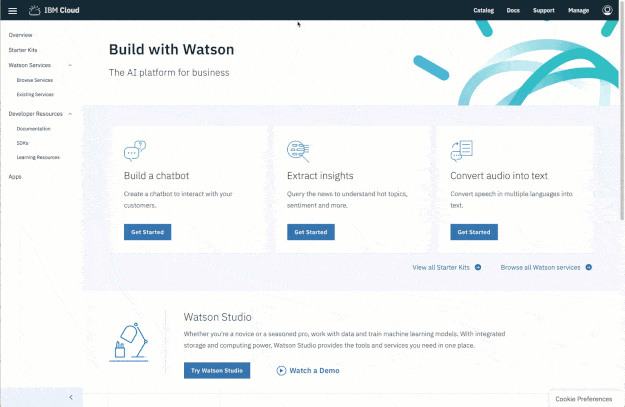

---

copyright:
  years: 2015, 2019
lastupdated: "2019-03-08"

keywords: getting started,watson

subcollection: watson

---

{:shortdesc: .shortdesc}
{:new_window: target="_blank"}
{:tip: .tip}
{:important: .important}
{:note: .note}
{:deprecated: .deprecated}
{:pre: .pre}
{:codeblock: .codeblock}
{:screen: .screen}
{:javascript: .ph data-hd-programlang='javascript'}
{:java: .ph data-hd-programlang='java'}
{:python: .ph data-hd-programlang='python'}
{:swift: .ph data-hd-programlang='swift'}
{:gif: data-image-type='gif'}

# Watson 및 {{site.data.keyword.cloud_notm}} 시작하기
{: #about}

몇 가지 단계만으로 {{site.data.keyword.ibmwatson}}을 시작할 수 있습니다.
{: shortdesc}

## 1단계: 무료 {{site.data.keyword.cloud_notm}} 계정 가져오기
{: #free-account}

시간 제한 없이 무료로 {{site.data.keyword.watson}} 서비스를 사용해 보려면 {{site.data.keyword.cloud_notm}}에서 계정을 작성하십시오: [무료로 가입하기 ](https://{DomainName}/registration/?target=%2Fdeveloper%2Fwatson%2Fdashboard){: new_window}. 계정을 확인하고 활성화하기 위한 이메일을 수신합니다.

## 2단계: 서비스 인스턴스 찾기 및 작성
{: #access-console}

1.  계정을 활성화하고 로그인한 후 {{site.data.keyword.watson}} 콘솔에서 **[서비스 찾아보기 ](https://{DomainName}/developer/watson/services){: new_window}**를 클릭하십시오. 
1.  요구사항에 맞는 서비스를 선택하십시오.
1.  무료로 서비스 인스턴스를 작성하십시오.

{: gif}

## 다음 단계
{: #gs-index-next-steps}

시작할 준비가 되었습니다.

- 사용 가능한 경우, 통합 개발 환경을 경험하려면 **도구 실행**을 클릭하십시오. 
- 서비스에 대한 [{{site.data.keyword.ibmwatson}} 문서 ](https://{DomainName}/developer/watson/documentation){: new_window}에 있는 **시작하기 튜토리얼**을 진행해 보십시오. 
- 이 튜토리얼을 사용하려면 서비스 인스턴스에 대한 인증 정보가 필요합니다. 
    - 서비스 인스턴스가 IAM 인증을 사용하는 경우에는 [IAM 토큰을 사용한 인증](/docs/services/watson?topic=watson-iam)을 참조하여 서비스 인증 정보에 액세스하십시오. 
    - 서비스 인스턴스가 Cloud Foundry 인증을 사용하는 경우에는 [Cloud Foundry 서비스 인증 정보를 사용한 인증](/docs/services/watson?topic=watson-creating-credentials#creating-credentials)을 참조하여 서비스 인증 정보에 액세스하십시오. 
