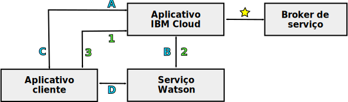

---

copyright:
  years: 2015, 2018
lastupdated: "2018-05-03"

---

{:shortdesc: .shortdesc}
{:new_window: target="_blank"}
{:tip: .tip}
{:pre: .pre}
{:codeblock: .codeblock}
{:screen: .screen}
{:javascript: .ph data-hd-programlang='javascript'}
{:java: .ph data-hd-programlang='java'}
{:python: .ph data-hd-programlang='python'}
{:swift: .ph data-hd-programlang='swift'}

# Modelos de programação para serviços do {{site.data.keyword.watson}}

Os serviços do {{site.data.keyword.watson}} suportam dois modelos de programação típicos para comunicações HTTP: retransmissões de solicitações por meio de um proxy e interação direta com um serviço.

Todos os serviços do {{site.data.keyword.watson}} oferecem interfaces REST. Alguns serviços oferecem outras interfaces de programação também. Por exemplo, o serviço do {{site.data.keyword.speechtotextshort}} inclui uma interface WebSocket que pode ser usada para estabelecer uma conexão persistente com o serviço. Para saber mais sobre as interfaces disponíveis para o serviço, consulte sua documentação.
{: shortdesc}

## Escolhendo um modelo

Devido à sua dependência de quaisquer credenciais de serviço ou tokens, cada modelos de programação oferece diferentes vantagens e desvantagens.

A comunicação direta com tokens oferece um modelo de programação poderoso. Em alguns casos, ele disponibiliza funcionalidade adicional, como a interface do WebSocket do serviço do {{site.data.keyword.speechtotextshort}}. Mas seja cauteloso ao usar tokens com seus aplicativos.

## Retransmitindo solicitações por meio de um proxy

Esse modelo requer que o cliente e o serviço se comuniquem por meio de um aplicativo proxy do lado do servidor que reside em {{site.data.keyword.cloud}}. A abordagem depende de credenciais de autenticação básica HTTP para as comunicações seguras do serviço.

Nesse modelo, o cliente e o serviço não se comunicam diretamente. Em vez disso, eles retransmitem todas as comunicações por meio do aplicativo proxy do {{site.data.keyword.cloud_notm}}. O aplicativo proxy é responsável por receber solicitações do cliente, passá-las ao serviço, obter uma resposta do serviço e passar os resultados para o cliente. O proxy deve incluir as credenciais de autenticação em cada solicitação no serviço.

Para obter mais informações, consulte [Credenciais de serviço para serviços do {{site.data.keyword.watson}}](/docs/services/watson/getting-started-credentials.html).

### Vantagens de retransmitir solicitações

Os dados são disponibilizados no {{site.data.keyword.cloud_notm}}, onde podem ser armazenados e usados com vários serviços. Com a interação direta, os dados estão disponíveis apenas no cliente.

O modelo de autenticação é mais simples que a interação direta. Como o modelo requer autenticação apenas do {{site.data.keyword.cloud_notm}}, ele pode usar com segurança as credenciais de autenticação básica HTTP para um serviço.

### Desvantagens da retransmissão de solicitações

A abordagem requer o desenvolvimento de um aplicativo proxy do lado do servidor e esse proxy e o cliente devem estabelecer um protocolo para ativar a troca de solicitações e resultados. Este aplicativo proxy é muito mais complexo do que o proxy de autenticação relativamente simples usado com a interação direta.

Latência e desempenho devem sofrer por causa da necessidade de estabelecer conexões adicionais e para retransmitir informações por meio do servidor proxy.

## Interação direta com um serviço

Com esse modelo, um cliente se comunica diretamente com um serviço sem passar por um aplicativo proxy no {{site.data.keyword.cloud_notm}}. O modelo depende de tokens de autenticação para ativar as comunicações seguras. Um aplicativo do lado do servidor ainda reside no {{site.data.keyword.cloud_notm}}, mas esse aplicativo atua apenas como um proxy de autenticação para o cliente.

O cliente envia uma solicitação de HTTP para o proxy quando ele precisa obter ou atualizar seu token. O proxy, por sua vez, envia uma solicitação HTTP `GET` e obtém o token. Além de rotear de forma transparente todas as solicitações para os serviços do {{site.data.keyword.watson}}, o {{site.data.keyword.cloud_notm}} inclui um componente que manipula a autenticação para todos os serviços, incluindo concessão e validação de tokens.

O proxy retorna o token para o cliente. O cliente, então, usa o token para comunicações autenticadas com o serviço. O cliente envia solicitações diretamente para o serviço e o serviço responde ao cliente. O cliente deve incluir o token em todas as solicitações que ele enviar para o serviço.

Para obter mais informações, consulte [Tokens para autenticação](/docs/services/watson/getting-started-tokens.html).

### Vantagens da interação direta

A eliminação do servidor proxy do caminho de comunicação leva a uma implementação mais simples e eficiente, além de maior
rendimento. A eliminação do servidor proxy reduz a latência eliminando a necessidade de estabelecer várias conexões para realizar as
comunicações entre o cliente e o serviço.

### Desvantagens da interação direta

Ao usar tokens, não exponha suas credenciais de serviço, pois isso pode expor o token a quaisquer potenciais
vulnerabilidades de cross-site scripting em seu aplicativo.

Tokens têm um TTL de uma hora. Um cliente pode fazer muitas chamadas para um serviço no tempo de vida do token. Porque as
comunicações ignoram o proxy do lado do servidor, o proxy não pode limitar a taxa ou controlar o número de chamadas feitas
pelo cliente, o que pode resultar em encargos de uso excessivos.

Os tokens fornecem acesso total à instância de serviço. Para serviços que mantêm dados stateful, os tokens podem permitir que
usuários maliciosos criem, modifiquem ou excluam recursos ou até mesmo excluam a própria instância de serviço.

## Caminhos de Comunicação

O diagrama a seguir apresenta uma visão geral de alto nível dos dois modelos de programação:

- Comunicações específicas para **retransmitir solicitações** por meio de um servidor proxy são
rotuladas com
números.
- Comunicações para **interação direta** são rotuladas com letras.

### Caminho comum

- : o aplicativo do lado do servidor se conecta a uma instância do serviço no {{site.data.keyword.cloud_notm}}. Esse aplicativo manipula todas as comunicações entre o cliente e o serviço.

    Quando ligado ao serviço, o aplicativo {{site.data.keyword.cloud_notm}} pode acessar a sua variável de ambiente `VCAP_SERVICES` . Essa variável
inclui a URL de conexão para o serviço, as credenciais de autenticação básica do cliente para o serviço e outras informações
associadas ao aplicativo.

Os caminhos de comunicações agora divergem.

### Retransmitindo por meio de um modelo de proxy (rotulado com números)

- 1: o aplicativo cliente envia solicitações para o aplicativo {{site.data.keyword.cloud_notm}} por uma API que é definida pelo desenvolvedor de aplicativos.
- 2: o aplicativo {{site.data.keyword.cloud_notm}} passa a solicitação do cliente para o serviço usando a API de REST do serviço. A solicitação deve incluir as credenciais de autenticação básica HTTP para o serviço obtido da variável de ambiente `VCAP_SERVICES` .
    - O serviço envia os resultados da solicitação para o aplicativo proxy {{site.data.keyword.cloud_notm}}.
- 3: o aplicativo {{site.data.keyword.cloud_notm}} retorna os resultados para o cliente por meio da API definida pelo aplicativo.

### Interação direta (rotulada com letras)

- A: o aplicativo cliente solicita um token de autenticação do aplicativo {{site.data.keyword.cloud_notm}}, geralmente por meio de uma solicitação HTTP `GET`.
- B: o aplicativo {{site.data.keyword.cloud_notm}} envia uma solicitação HTTP `GET` para o componente de autenticação do serviço. A solicitação inclui as credenciais de autenticação básica HTTP para o serviço obtido da variável de ambiente `VCAP_SERVICES`. O serviço responde com um token de autenticação limitado por tempo.
- C: o aplicativo {{site.data.keyword.cloud_notm}} retorna o token de autenticação ao cliente para usar em solicitações para o serviço. O cliente então se comunica com o aplicativo {{site.data.keyword.cloud_notm}} somente quando precisa atualizar seu token.
- D: o cliente envia solicitações diretamente para o serviço por meio da API do serviço. O cliente deve passar o seu token de autenticação com cada solicitação por meio do cabeçalho da solicitação `X-Watson-Authorization-Token`, o parâmetro de consulta `watson-token` ou como um cookie. O serviço valida o token do cliente e roteia a solicitação para o serviço. O serviço responde diretamente ao cliente.
