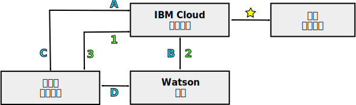

---

copyright:
  years: 2015, 2018
lastupdated: "2018-05-03"

---

{:shortdesc: .shortdesc}
{:new_window: target="_blank"}
{:tip: .tip}
{:pre: .pre}
{:codeblock: .codeblock}
{:screen: .screen}
{:javascript: .ph data-hd-programlang='javascript'}
{:java: .ph data-hd-programlang='java'}
{:python: .ph data-hd-programlang='python'}
{:swift: .ph data-hd-programlang='swift'}

# {{site.data.keyword.watson}} 服务的编程模型

{{site.data.keyword.watson}} 服务支持将两种典型编程模型用于 HTTP 通信：通过代理中继请求和直接与服务进行交互。

所有 {{site.data.keyword.watson}} 服务都提供 REST 接口。某些服务还提供其他编程接口。例如，{{site.data.keyword.speechtotextshort}} 服务包含 WebSocket 接口，该接口可用于建立与服务的持久连接。要了解有关服务可用接口的更多信息，请参阅其文档。
{: shortdesc}

## 选择模型

由于编程模型依赖于服务凭证或令牌，因此每个模型都具有不同的优点和缺点。

直接与令牌通信提供一个强大的编程模型。在某些情况下，还提供其他功能，例如，{{site.data.keyword.speechtotextshort}} 服务的 WebSocket 接口。但是，在将令牌用于应用程序时，请谨慎。

## 通过代理中继请求

此模型要求客户机和服务通过位于 {{site.data.keyword.cloud}} 中的服务器端代理应用程序进行通信。此方法依赖于用于安全通信的服务的 HTTP 基本认证凭证。

在此模型中，客户机和服务不直接通信。而是通过 {{site.data.keyword.cloud_notm}} 代理应用程序中继所有通信。代理应用程序负责接收来自客户机的请求，将它们传递到服务，从服务获取响应，然后将结果传递给客户机。代理必须在服务的每个请求中包含认证凭证。

有关更多信息，请参阅 [{{site.data.keyword.watson}} 服务的服务凭证](/docs/services/watson/getting-started-credentials.html)。

### 中继请求的优点

在 {{site.data.keyword.cloud_notm}} 中提供数据，数据可存储在此处并且可用于多个服务。使用直接交互，仅在客户机上提供数据。

认证模型比直接交互简单。因为模型仅要求从 {{site.data.keyword.cloud_notm}} 进行认证，因此可安全地使用服务的 HTTP 基本认证凭证。

### 中继请求的缺点

此方法要求开发服务器端代理应用程序，并且其代理和客户机必须建立协议以支持交换请求和结果。此代理应用程序比用于直接交互的相对简单的认证代理复杂的多。

由于需要建立额外的连接并且通过代理服务器中继信息，因此等待时间和性能可能会受到影响。

## 直接与服务交互

使用此模型，客户机直接与服务通信，而不经过 {{site.data.keyword.cloud_notm}} 中的代理应用程序。该模型依靠认证令牌来启用安全通信。服务器端应用程序仍位于 {{site.data.keyword.cloud_notm}} 中，但是此应用程序仅充当客户机的认证代理。

在需要获取或刷新其令牌时，客户机向代理发送 HTTP 请求。然后，代理发送 HTTP `GET` 请求并获取令牌。除了透明地将所有请求路由至 {{site.data.keyword.watson}} 服务，{{site.data.keyword.cloud_notm}} 包含一个处理所有服务认证的组件，包括授予和验证令牌。

代理将令牌返回给客户机。然后，客户机将令牌用于服务的认证通信。客户机直接将请求发送给服务，并且服务响应客户机。客户机必须在其发送给服务的所有请求中包含令牌。

有关更多信息，请参阅[认证令牌](/docs/services/watson/getting-started-tokens.html)。

### 直接交互的优点

无需在通信路径中使用代理服务器，可实现更简单、更高效的实施和更高的吞吐量。不再需要使用代理服务器，无需建立多个连接也可实现客户机与服务之间的通信，从而缩短等待时间。

### 直接交互的缺点

虽然使用令牌不会公开服务凭证，但是会将令牌公开给应用程序中任何可能的跨站点脚本编制漏洞。

令牌具有一小时的 TTL。客户机可在令牌生命周期内对服务发起多次调用。由于通信绕过服务器端代理，因此代理无法实施速率限制或控制客户机发出的调用数，这可能导致使用量过高。

令牌提供对服务实例的完全访问权。对于维护有状态数据的服务，令牌支持恶意用户创建、修改或删除资源，甚至删除服务实例自身。

## 通信路径

下图显示两种编程模型的高级概述：

- 特定于通过代理服务器**中继请求**的通信使用数字进行标记。
- **直接交互**通信使用字母进行标记。

### 公共路径

- ：服务器端应用程序绑定到 {{site.data.keyword.cloud_notm}} 中的服务实例。此应用程序处理客户机与服务之间的所有通信。

    在绑定到服务时，{{site.data.keyword.cloud_notm}} 应用程序可访问其 `VCAP_SERVICES` [环境变量](/docs/services/watson/getting-started-variables.html)。此变量包含服务的连接 URL、服务的客户机基本认证凭证以及与应用程序相关联的其他信息。

现在，通信路径有所不同。

### 通过代理模型进行中继（使用数字标记）

- 1：客户机应用程序通过应用程序开发者定义的 API 向 {{site.data.keyword.cloud_notm}} 应用程序发送请求。
- 2：{{site.data.keyword.cloud_notm}} 应用程序通过使用服务的 REST API，将请求从客户机传递到服务。请求必须包含从 `VCAP_SERVICES` [环境变量](/docs/services/watson/getting-started-variables.html)获取的服务的 HTTP 基本认证凭证。
    - 服务将请求的结果发送给 {{site.data.keyword.cloud_notm}} 代理应用程序。
- 3：{{site.data.keyword.cloud_notm}} 应用程序通过应用程序定义的 API 将结果返回给客户机。

### 直接交互（使用字母标记）

- A：客户机应用程序从 {{site.data.keyword.cloud_notm}} 应用程序请求认证令牌，通常通过 HTTP `GET` 请求。
- B：{{site.data.keyword.cloud_notm}} 应用程序将 HTTP `GET` 请求发送到服务的认证组件。请求包含从 `VCAP_SERVICES` 环境变量获取的服务的 HTTP 基本认证凭证。服务使用时间限制的认证令牌进行响应。
- C：{{site.data.keyword.cloud_notm}} 应用程序返回客户机的认证令牌以用于服务的请求。然后，客户机仅在需要刷新其令牌时才与 {{site.data.keyword.cloud_notm}} 应用程序进行通信。
- D：客户机直接通过服务的 API 向服务发送请求。客户机必须通过 `X-Watson-Authorization-Token` 请求头、`watson-token` 查询参数或作为 cookie 随每个请求一起传递其认证令牌。服务验证客户机的令牌并将请求路由到服务。服务直接响应客户机。
