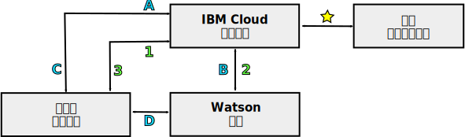

---

copyright:
  years: 2015, 2018
lastupdated: "2018-05-03"

---

{:shortdesc: .shortdesc}
{:new_window: target="_blank"}
{:tip: .tip}
{:pre: .pre}
{:codeblock: .codeblock}
{:screen: .screen}
{:javascript: .ph data-hd-programlang='javascript'}
{:java: .ph data-hd-programlang='java'}
{:python: .ph data-hd-programlang='python'}
{:swift: .ph data-hd-programlang='swift'}

# {{site.data.keyword.watson}} 服務的程式設計模型

{{site.data.keyword.watson}} 服務支援兩種 HTTP 通訊用的一般程式設計模型：透過 Proxy 中繼傳遞要求，以及直接與服務互動。

所有 {{site.data.keyword.watson}} 服務都提供 REST 介面。部分服務也提供其他程式設計介面。例如，{{site.data.keyword.speechtotextshort}} 服務包含 WebSocket 介面，您可以用它來建立與服務的持續性連線。若要進一步瞭解服務的可用介面，請參閱其說明文件。
{: shortdesc}

## 選擇模型

因為對於服務認證或記號的依賴，每個程式設計模型都提供不同的優缺點。

使用記號進行直接通訊提供了強大的程式設計模型。在某些情況下，它會提供其他功能，例如 {{site.data.keyword.speechtotextshort}} 服務的 WebSocket 介面。但搭配您的應用程式使用記號時，請特別小心。

## 透過 Proxy 中繼傳遞要求

這個模型需要用戶端和服務透過位於 {{site.data.keyword.cloud}} 中的伺服器端 Proxy 應用程式來進行通訊。該方法依賴於服務的 HTTP 基本鑑別認證來進行安全通訊。

在此模型中，用戶端和服務不會直接通訊。它們會改為透過 {{site.data.keyword.cloud_notm}} Proxy 應用程式來中繼傳遞所有通訊。Proxy 應用程式負責接收來自用戶端的要求、將要求傳遞給服務、取得服務的回應，以及將結果傳遞給用戶端。Proxy 必須在給服務的每個要求中包含鑑別認證。

如需相關資訊，請參閱 [{{site.data.keyword.watson}} 服務的服務認證](/docs/services/watson/getting-started-credentials.html)。

### 中繼傳遞要求的優點

資料可在 {{site.data.keyword.cloud_notm}} 中使用，在這裡可以儲存並與多個服務搭配使用。透過直接互動，資料僅可在用戶端上使用。

鑑別模型比直接互動簡單。因為模型只需要來自 {{site.data.keyword.cloud_notm}} 的鑑別，所以它可以安全地將 HTTP 基本鑑別認證用於服務。

### 中繼傳遞要求的缺點

這個方法需要開發伺服器端 Proxy 應用程式，而這個 Proxy 和用戶端必須建立一個通訊協定，以便能夠交換要求和結果。這個 Proxy 應用程式遠比直接互動所使用的相對簡單鑑別 Proxy 更為複雜。

因為需要建立額外的連線及透過 Proxy 伺服器中繼傳遞資訊，所以可能會導致延遲及效能受到影響。

## 與服務的直接互動

使用此模型，用戶端會直接與服務進行通訊，而無需透過 {{site.data.keyword.cloud_notm}} 中的 Proxy 應用程式。該模型依賴鑑別記號來啟用安全通訊。伺服器端應用程式仍位於 {{site.data.keyword.cloud_notm}}，但此應用程式只擔任用戶端的鑑別 Proxy。

當用戶端需要取得或重新整理其記號時，用戶端會傳送 HTTP 要求給 Proxy。Proxy 接著再傳送 HTTP `GET` 要求，並取得記號。除了透通地將所有要求遞送至 {{site.data.keyword.watson}} 服務之外，{{site.data.keyword.cloud_notm}} 還包括處理所有服務鑑別（包括授與及驗證記號）的元件。

Proxy 會將記號傳回給用戶端。之後，用戶端會使用記號來進行與服務的已鑑別通訊。用戶端會直接傳送要求給服務，而服務會回應用戶端。用戶端必須在它傳送給服務的所有要求中包含記號。

如需相關資訊，請參閱[鑑別用的記號](/docs/services/watson/getting-started-tokens.html)。

### 直接互動的優點

從通訊路徑中刪除 Proxy 伺服器，可以得到更簡單、更有效率的實作及更高的傳輸量。刪除 Proxy 伺服器可減少延遲，因為不需要建立多個連線以實現用戶端與服務之間的通訊。

### 直接互動的缺點

使用記號並不會公開您的服務認證，不過它可能會讓記號公開暴露於應用程式中潛在的跨網站 Scripting 漏洞。

記號具有一個小時的 TTL。用戶端可以在記號的生命期限內對服務進行許多呼叫。因為通訊會略過伺服器端 Proxy，所以 Proxy 無法限制速率或是以其他方式控制用戶端進行的呼叫數，這可能會導致龐大的用量費用。

記號提供對服務實例的完整存取權。對於維護有狀態資料的服務，記號可以讓惡意使用者建立、修改或刪除資源，甚至刪除服務實例本身。

## 通訊路徑

下圖會呈現兩個程式設計模型的進階概觀：

- 透過 Proxy 伺服器**中繼傳遞要求**的特定通訊以數字標示。
- **直接互動**的通訊以字母標示。

### 一般路徑

- ：伺服器端應用程式連結至 {{site.data.keyword.cloud_notm}} 中的服務實例。此應用程式會處理用戶端與服務之間的所有通訊。

    連結至服務時，{{site.data.keyword.cloud_notm}} 應用程式可以存取其 `VCAP_SERVICES` [環境變數](/docs/services/watson/getting-started-variables.html)。此變數包含服務的連線 URL、服務的用戶端基本鑑別認證，以及與應用程式相關聯的其他資訊。

現在有多種通訊路徑。

### 透過 Proxy 模型進行中繼傳遞（以數字標示）

- 1：用戶端應用程式透過應用程式開發人員所定義的 API，傳送要求給 {{site.data.keyword.cloud_notm}} 應用程式。
- 2：{{site.data.keyword.cloud_notm}} 應用程式使用服務的 REST API，將要求從用戶端傳遞至服務。要求必須包含從 `VCAP_SERVICES` [環境變數](/docs/services/watson/getting-started-variables.html)取得之服務的 HTTP 基本鑑別認證。
    - 服務將要求的結果傳送給 {{site.data.keyword.cloud_notm}} Proxy 應用程式。
- 3：{{site.data.keyword.cloud_notm}} 應用程式將結果透過應用程式定義的 API 傳回用戶端。

### 直接互動（以字母標示）

- A：用戶端應用程式從 {{site.data.keyword.cloud_notm}} 應用程式要求鑑別記號，這通常是透過 HTTP `GET` 要求。
- B：{{site.data.keyword.cloud_notm}} 應用程式傳送 HTTP `GET` 要求給服務的鑑別元件。要求包含從 `VCAP_SERVICES` 環境變數取得之服務的 HTTP 基本鑑別認證。服務回應一個有時間限制的鑑別記號。
- C：{{site.data.keyword.cloud_notm}} 應用程式傳回鑑別記號，讓用戶端用於對服務的要求。之後，只有當用戶端需要重新整理其記號時，才會與 {{site.data.keyword.cloud_notm}} 應用程式通訊。
- D：用戶端透過服務的 API 直接傳送要求給服務。用戶端必須透過 `X-Watson-Authorization-Token` 要求標頭、`watson-token` 查詢參數或 Cookie，將與每個要求一起傳遞其鑑別記號。服務會驗證用戶端的記號，並將要求遞送至服務。服務直接回應用戶端。
